# Resumen proyecto DAW asignatura interfaces web.
Este documento explicará el trabajo realizado en el proyecto DAW tiene el objetivo de poder qualificar la interfaz realizada para la asignatura interfaces web por el profesor Javi.

- [Resumen proyecto DAW asignatura interfaces web.](#resumen-proyecto-daw-asignatura-interfaces-web)
  - [Apartado cliente](#apartado-cliente)
    - [Home](#home)
    - [Signin Modal](#signin-modal)
    - [Signup Modal](#signup-modal)
    - [Shop](#shop)
    - [Navbar](#navbar)
    - [Modal Ticket](#modal-ticket)
  - [Panel Admin](#panel-admin)
    - [Dashboard](#dashboard)
    - [Tickets, Products y Users](#tickets-products-y-users)

## Apartado cliente

### Home
El home contiene de un slider donde se repiten imágenes, toda su funcionalidad ha sido programado desde 0 por Iván ya que vuestic desgraciadamente no contiene ningún slider de imagenes.

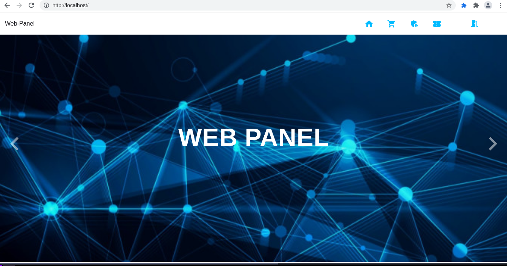

Consideramos evaluable el contenido scss empezando desde la siguiente [línea](frontend/src/components/global/ImageCarousel.vue#L89)

### Signin Modal
El modal signin ha sido realizado utilizando el componente [va-modal](https://vuestic.dev/en/ui-elements/modal) 

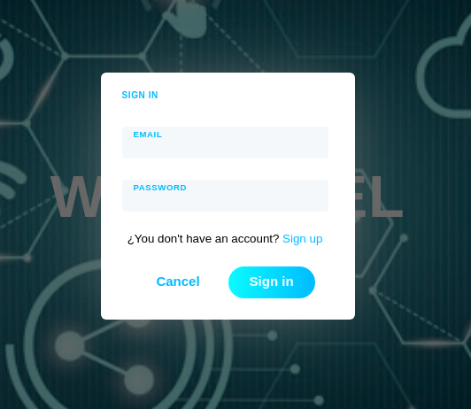

También se utilizan los componentes: [va-input](https://vuestic.dev/en/ui-elements/input), [va-button](https://vuestic.dev/en/ui-elements/button), [va-form](https://vuestic.dev/en/ui-elements/form)

Fichero: [SignInModal.vue](frontend/src/components/login/SignInModal.vue)

### Signup Modal
El modal signup no tiene mucha diferencia al signin modal

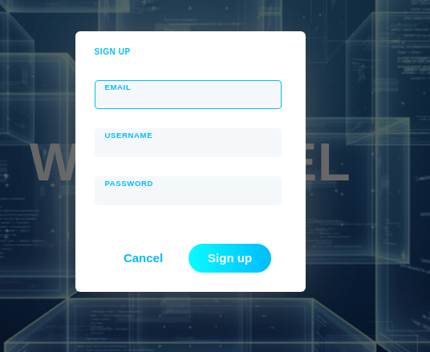

Fichero: [SignUpModal.vue](frontend/src/components/login/SignUpModal.vue)

### Shop 
El shop está compuesto por una lista de componentes [va-card](https://vuestic.dev/en/ui-elements/card) y la paginación con [va-pagination](https://vuestic.dev/en/ui-elements/pagination)
Los componentes va-card son responsives con un sistema similar a bootstrap usando las clases: flex, xs, sm, md, lg

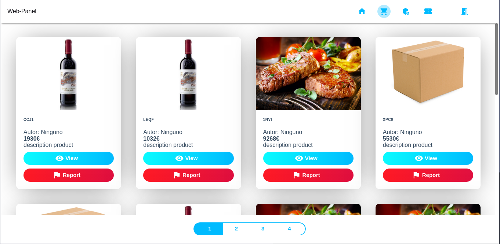
Consideramos evaluable el contenido html y scss del siguiente archivo: [ProductElement.vue](frontend/src/components/shop/ProductElement.vue)

### Navbar
El navbar se muestra en todas las partes de la aplicación excepto en el panel, usando el siguiente componente [va-navbar](https://vuestic.dev/en/ui-elements/navbar)

Fichero [NavBar.vue](frontend/src/components/NavBar.vue)

### Modal Ticket
La aplicación proporciona un modal para crear distintos tipos de tickets 
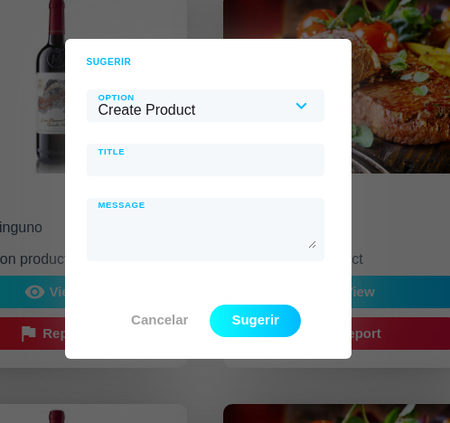

## Panel Admin

### Dashboard

El dashboard se compone de varios gráficos con estadísticas de la página web, con selección de fecha y año para ver las estadísticas de un periodo específico: [Dashboard.vue](frontend/src/components/panel/Dashboard.vue)

Los componentes utilizados son: `va-card`, `va-date-input`, `va-button`, y `va-chart`.

Se maqueta de manera responsiva con las clases: `row`, `flex`, `xs12`, `md6`, `flex-center` y `offset--md3`.

Y se utiliza la clase `text--bold` para dar estilo al texto.

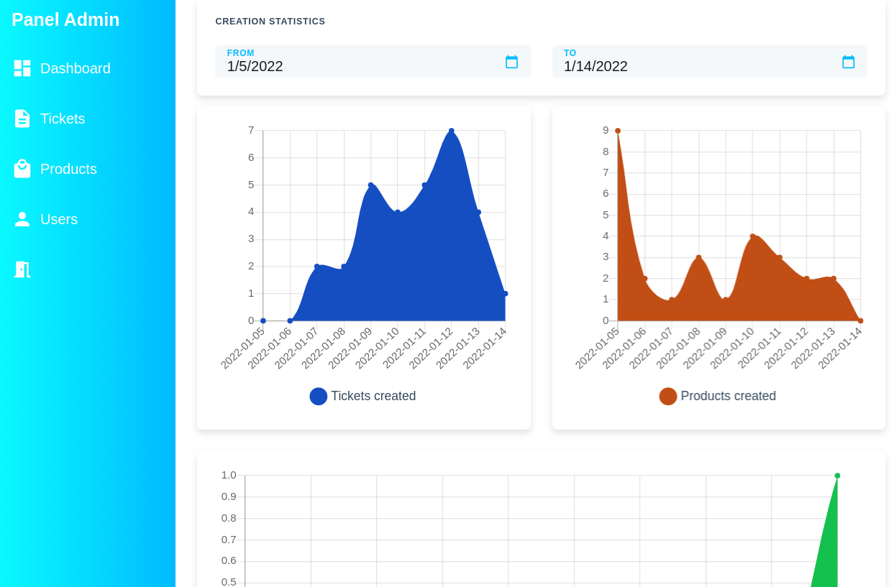

### Tickets, Products y Users

Las páginas de [Tickets](frontend/src/components/panel/Tickets.vue), [Products](frontend/src/components/panel/Products.vue) y [Users](frontend/src/components/panel/Users.vue) tienen un diseño y funcionalidad similar, y sirven para gestionar cada uno de sus elementos, respectivamente.

En cada página se muestran los datos con una tabla, gracias al componente `va-data-table`. Se muestran imágenes en las filas con `va-avatar`, y se realiza la paginación con `va-pagination`.

Otros componentes utilizados son `va-card`, `va-tabs`/`va-tab` (para pestañas de datos diferentes), `va-date-input`, `va-select`, `va-icon`, `va-button`. `va-icon` utiliza los iconos de Google Material

Para mostrar los estados o tipos de productos se han creado componentes ([RoleBadge.vue](frontend/src/components/global/shared/RoleBadge.vue), [StatusBadge.vue](frontend/src/components/global/shared/StatusBadge.vue), [TicketTypeBadge.vue](frontend/src/components/global/shared/TicketTypeBadge.vue)) que a su vez utilizan el componente `va-badge`. Esto les da un formato redondeado y con colores a los diferentes tipos, estados y roles.

Para administrar varios elementos a la vez [se ha creado también un componente (Selected.vue)](frontend/src/components/global/shared/Selected.vue) que lista las acciones a realizar en masa y de igual forma es maquetado con las clases responsivas. Utiliza los componentes de `va-select`, `va-switch` para confirmación y `va-button` para realizar la acción.

Se maqueta de manera responsiva con las clases: `row`, `flex`, `flex-center`, `xs3`, `xs9`, `md2`, `md10`, `lg2`, `lg4` y `offset--lg6`.

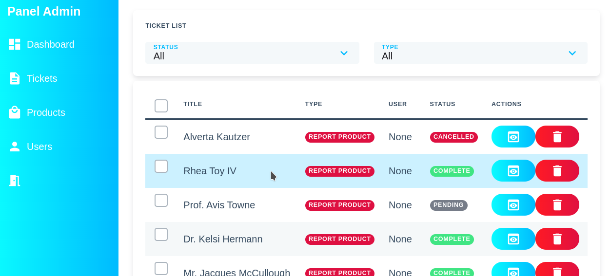

> 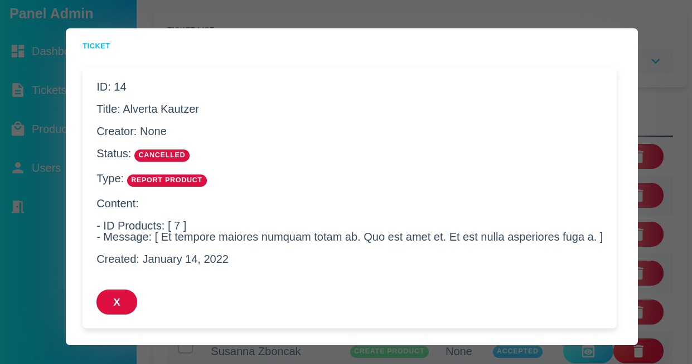
> Este es el modal de ver Ticket, que utiliza `va-card` y algunos badges.

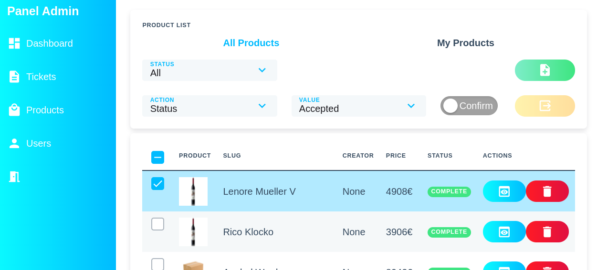

> 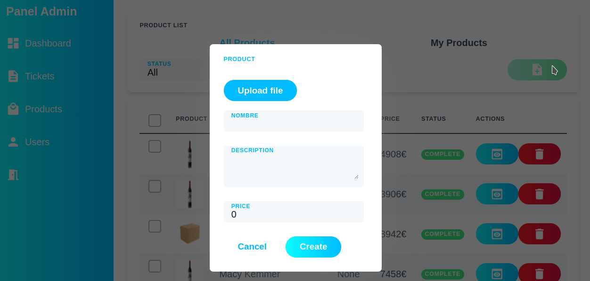
> Este es el modal de crear producto, que utiliza `va-form`, `va-input` y `va-file-upload`

> 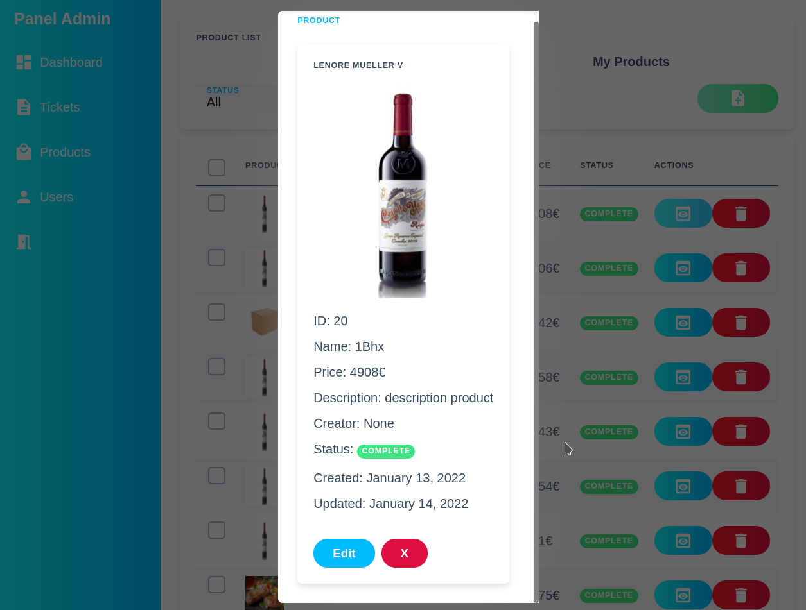
> Este es el modal de ver un producto, que utiliza `va-card` y algunos badges.
> 
> El modal de editar producto es igual visualmente que el de crear pero rellena los campos con los datos.

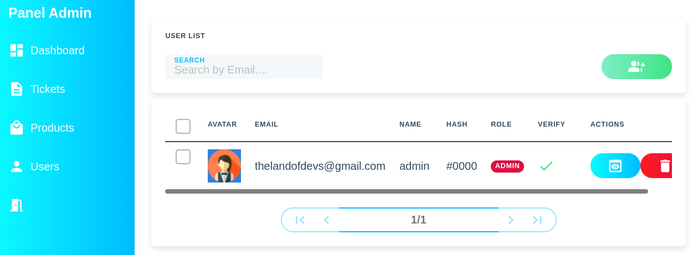

> 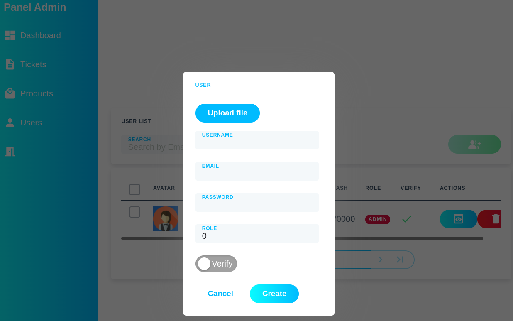
> Este es el modal de crear un usuario, que utiliza `va-form`, `va-input`, `va-switch` y `va-file-upload`

> 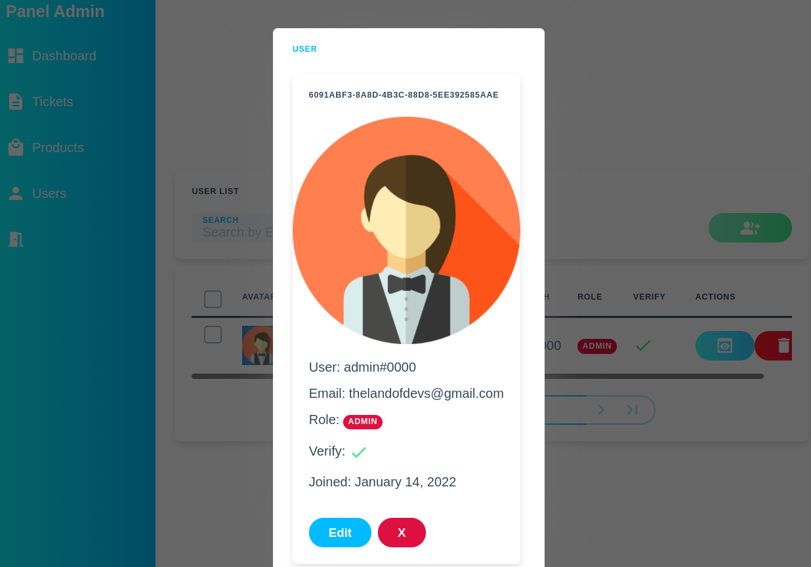
> Este es el modal de ver un usuario, que utiliza `va-card`, `va-icon` y algunos badges.
> 
> El modal de editar usuario es igual visualmente que el de crear pero rellena los campos con los datos.

